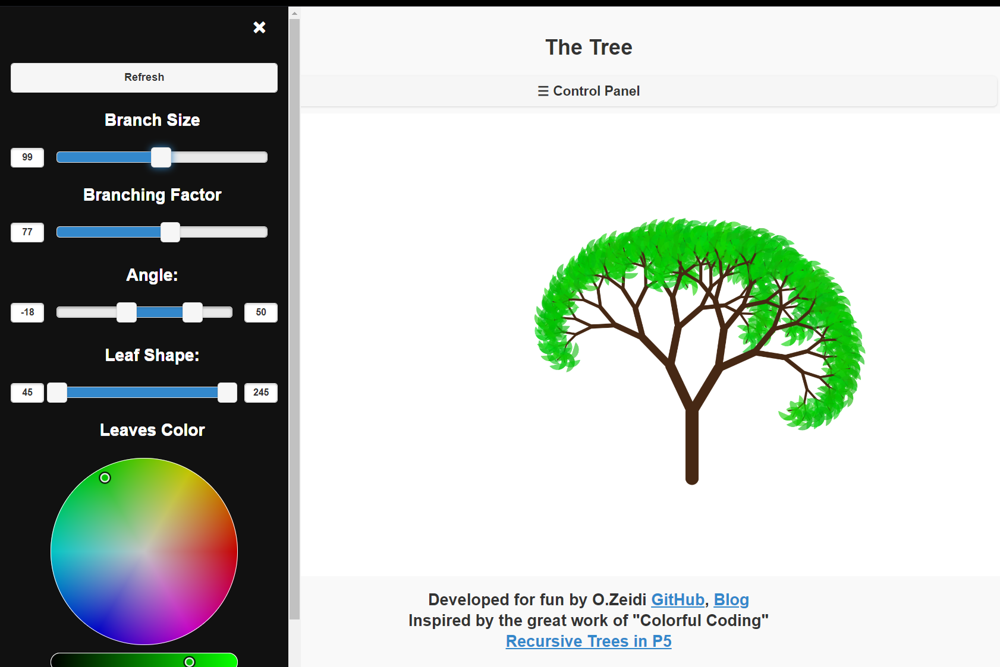

# Recursive Tree 

[](https://github.com/RichardLitt/standard-readme)


## Table of Contents

- [Background](#background)
- [Live Demo](#live-demo)
- [Install](#install)
- [Resources](#Resources)
- [License](#license)

## Background

Crating beautiful recursive tree with P5.js. This work is built upon the outstanding tutorial from "Colorful Coding" Youtube Channel. I highly recommend watching that tutorial [HERE](https://www.youtube.com/watch?v=-3HwUKsovBE&t=264s).

## Live Demo
- [Recursive Tree Demo](recursive-tree.netlify.app)

## Install

1. Clone this repo to your machine.

```sh
$ git clone https://github.com/Ozeidi/Twitter_Scraper.git
```
2. To test the code, I highly recommend using VS Code. I use `Live Server` extension to serve the app locally.


## Live Demo
- [CODEPEN](https://codepen.io/ozeidi/project/full/DGyMQJ)
##  Resources
- [Colorful Coding Youtube Channel](https://www.youtube.com/channel/UCWOTJIT48V9vxKoqdQBTHnw):
An excelent Resource for P5.JS tutorials and Generative Art.
- [The Coding Train Youtube Channel](https://www.youtube.com/c/TheCodingTrain/featured): Daniel Shiffman Coding Train channel is dedicated to beginner-friendly creative coding tutorials and challenges. 
## License

[MIT](LICENSE) © Omar Al Zeidi
{"mode":"full","isActive":false}